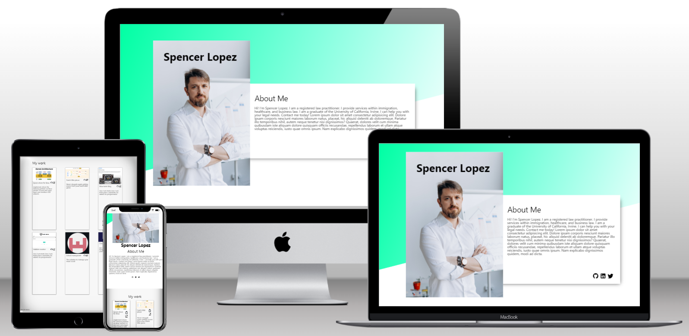
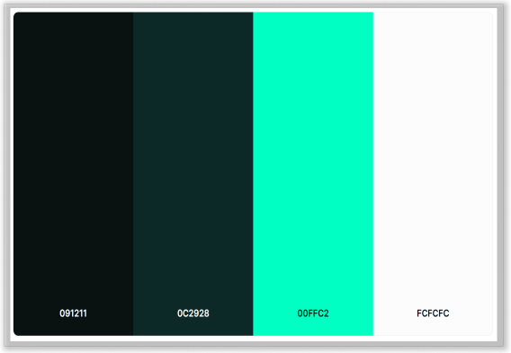

# Portfolio
A basic portfolio page for a fictitious person. It is a part of the Advanced Front-End Training Program at Brainnest. This project showcases collaborative work using CSS Grid, Flexbox, CSS functions, etc..

The deployed site can be found [here](https://jtm2021.github.io/Portfolio/).
The repository can be found [here](https://github.com/jtm2021/Portfolio).

## Wireframes
The wireframes for this project were created using Figma.

Click To See Desktop Wireframe

Click To See Tablets Wireframe

Click To See Phones Wireframe

## Typography
This project used an external font from [Google Fonts](https://fonts.google.com/). The font used is [Montserrat](https://fonts.google.com/specimen/Montserrat).

## Color Scheme
The color scheme used in this project was created using [Coolors](https://coolors.co/). The colors used are:

## Images & Icons
Icons were downloaded from [Material Design Icons](https://materialdesignicons.com/). Images were downloaded from [Pexels](https://pexels.com) and various sources.

Here are the links:
- Main Profile Picture: [Pexels](https://www.pexels.com/photo/a-businessman-wearing-white-long-sleeves-6592361/)
- Contact Section Picture: [Pexels](https://www.pexels.com/photo/a-man-in-white-long-sleeves-using-a-laptop-6592661/)
- Kernel: [infoq](https://res.infoq.com/presentations/facebook-google-bpf-linux-kernel/en/slides/sl1-1586362917749.jpg)
- DutchBlitz placar: [vercel](https://react-placar-dutch-blitz-3s7gohu3k-walterfcarvalho.vercel.app/)
- PPR Tool [Vercel](https://simuladorppr.vercel.app/)
- Wow taste: [github](https://jtm2021.github.io/wowtaste/)
- Titan digital [github](https://jtm2021.github.io/Titan/)
- Scool managment [github](https://github.com/Gbemi06/School-Management)