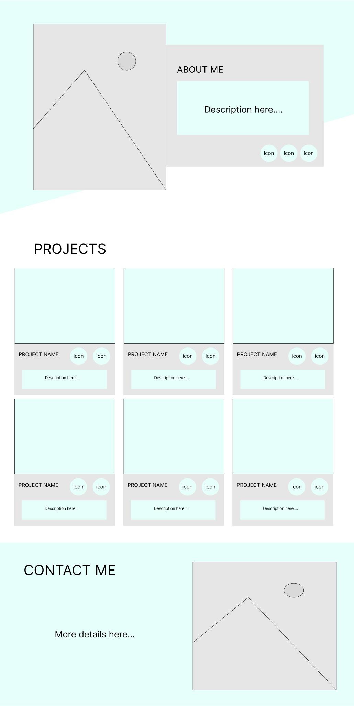
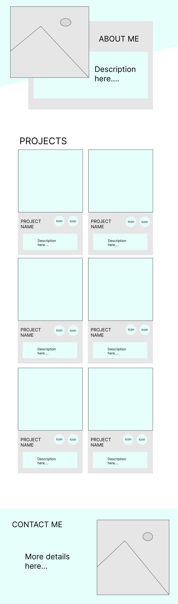
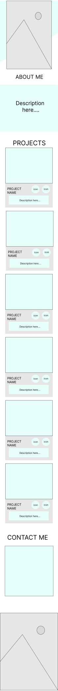

# Portfolio
A basic portfolio page for a fictitious person. It is a part of the Advanced Front-End Training Program at Brainnest. This project showcases collaborative work using CSS Grid, Flexbox, ARIA, etc..

## Wireframes
The wireframes for this project were created using Figma.

Click To See Desktop Wireframe

Click To See Tablets Wireframe

Click To See Phones Wireframe

